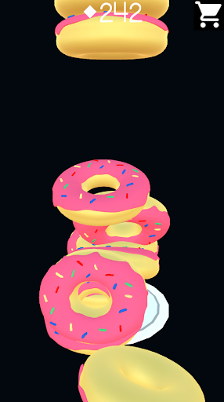

# FlapStack

Arcade Game where you attempt to stack as many pancakes and other foods on a plate as you can. Battle with Physics itself to see how high you can stack it! Originally made for Android mobile devices.

## Play Now

Download the application for free on Windows from: 

  
  
  
  

## Features

### Physics Simulation

Push your abilities to the limit as you fight with Physics itself to try and stack as many foods on the plate as possible.

© Nathan Foote | 2018
